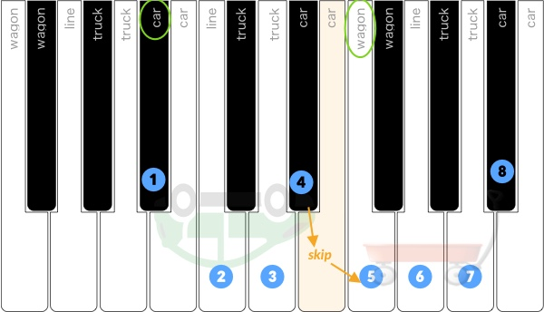

**12Scales**

**12Scales** is a short online class / app which uses interactive keyboards and quizzes to teach a student how to play all 12 Major Scales on the piano in a very unique way.

Instead of the usual approach - i.e. "take a giant chart of major scales and memorize it," 12Scales breaks the challenge down into easily digestible pieces, with short quizzes for each concept.

The basic concepts:

- The four shapes
- Which shape goes where
- How to fit the shapes together to make all 12 scales.

[Go to Live Site](http://www.12scales.com)
